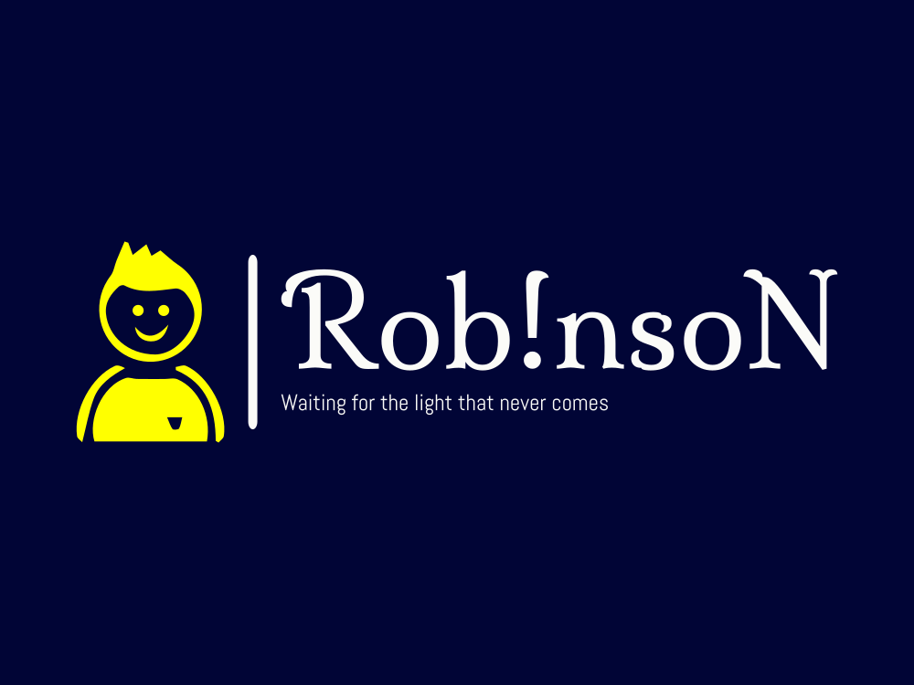

# Robinson Chatbot



# Chatbot Project

This project is a chatbot application that utilizes DialoGPT in the Flask backend and a React.js frontend. Users can interact with the chatbot seamlessly.

## Project Structure

The project is organized into two main folders:

- **client**: Contains the React.js frontend code.
- **server**: Contains the Flask backend code.

## Setup Instructions

To get started with the project, follow these steps:

### 1. Clone the Repository

First, clone the Git repository to your local machine:

```bash
git clone <repository-url>
```

### 2. Set Up the Flask Backend
Navigate to the `server` folder:
```bash
cd server
```
#### Create a Virtual Environment

Create a virtual environment to manage dependencies:
```bash
python -m venv venv
```
#### Activate the Virtual Environment

-   **On Windows**:

```bash
`venv\Scripts\activate` 
```
-   **On macOS/Linux**:

```bash
`source venv/bin/activate`
```

#### Install Requirements

Install the required packages using the `requirements.txt` file:

```bash
`pip install -r requirements.txt` 
```
#### Run the Flask App

Start the Flask application:

```bash
`flask run` 
```
Leave this terminal open to keep the backend running and open new terminal at the   **root** of the project.

### 3. Set Up the React Frontend

Navigate to the `client` folder:

```bash
cd client
``` 
#### Install Dependencies

Install the required dependencies for the React app:

```bash
npm install
``` 

#### Start the React App

Run the React application:

```bash
npm run dev
```
### 4. Interact with the Chatbot

Once both the Flask and React applications are running, you can interact with the chatbot through the frontend interface.

### Project Features

-   **User Interaction**: Users can send messages and receive responses from the chatbot.
-   **Clear Chat Option**: Users have the ability to clear the chat history.
-   **Responsive Design**: The application is designed to be user-friendly and visually appealing.

### Technologies Used

-   **Backend**: Flask, DialoGPT (Hugging Face Transformers)
-   **Frontend**: React.js, Axios for API calls
-   **Styling**: CSS for UI design

### Author

Developed by Kavindu Pramod.

For more information, visit my [portfolio](https://kavindupramod.netlify.app/).
`